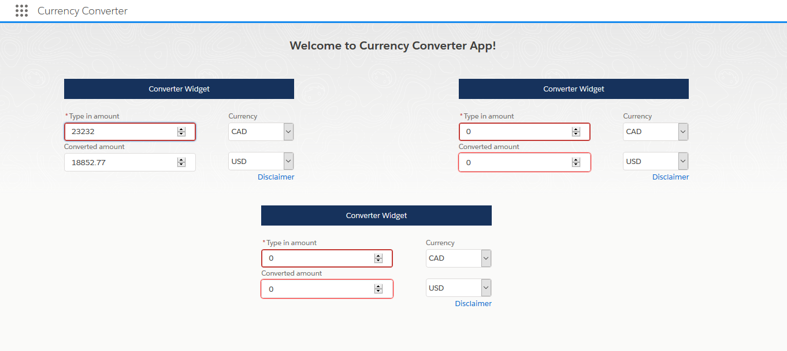

# Currency Converter

This demo project calculates live currency using foreign exchange rates. Currency converter is for currencies CAD, USD, EUR. It is developed using Lightning Design System and leverages APIs from http://fixer.io/. 

## Running Currency Converter locally

Follow the below commands to run the application locally.

```
	git clone https://github.com/ayushmunjal/CurrencyConverter.git
    cd CurrencyConverter
	npm install
	npm start
```

You can then access ENGAGE here: `http://localhost:4200/`. 



## Working with Currency Converter

### prerequisites

The following items should be installed in your system:
* Node.js 
* git command line tool 